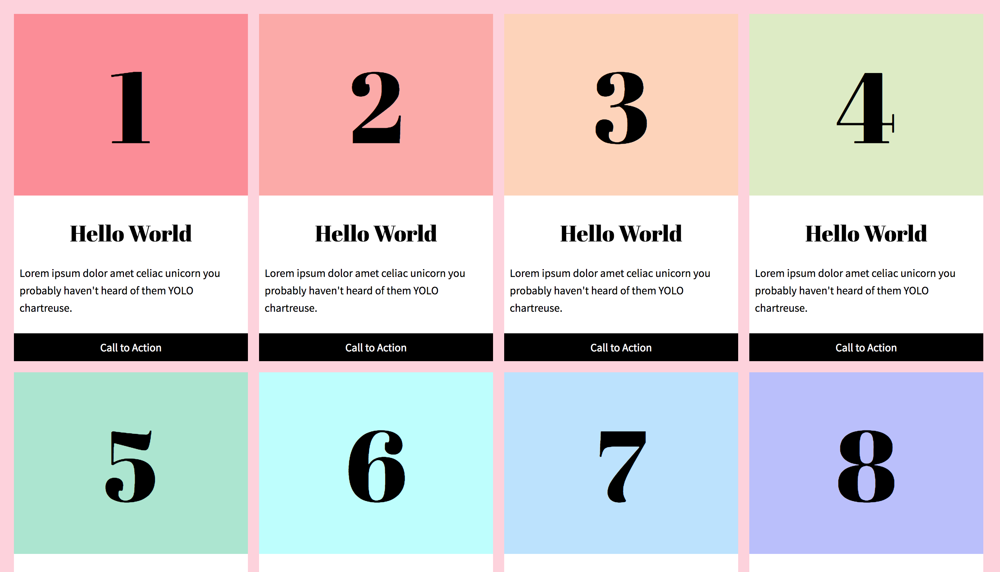
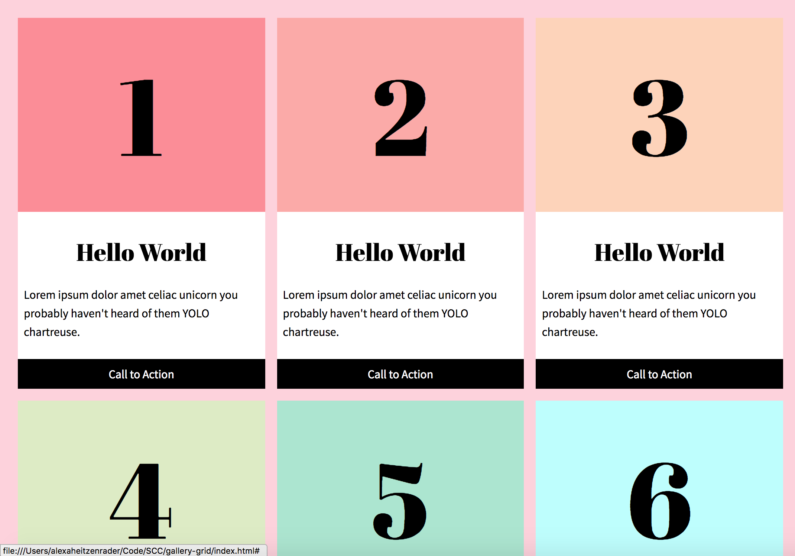
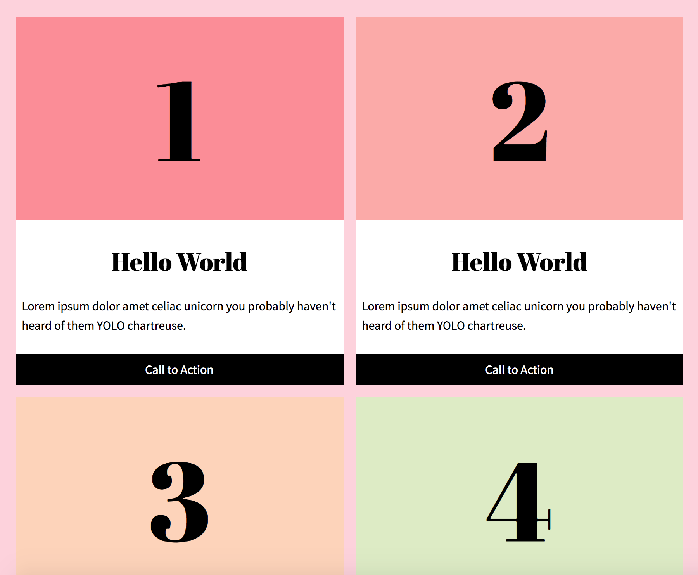
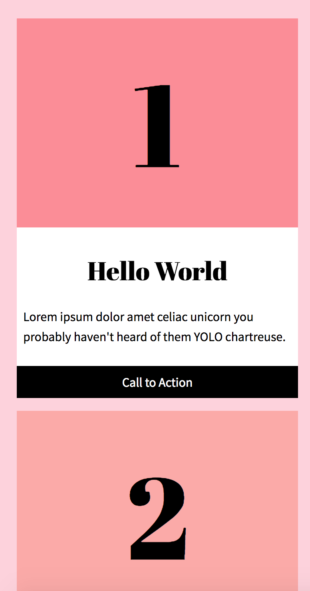

# gallery-grid

Quick CSS grid tutorial. 

**Original Tutorial**

<a href="https://bryanlrobinson.com/blog/2017/07/26/howto-css-grid-layout-to-make-a-simple-fluid-card-grid/" target="blank">Gallery Grid Tutorial</a>

**Screenshots**

**Live link:**
<a href="https://aheitzen.github.io/gallery-grid/" target="blank">Gallery Grid Live Link</a>

**Technologies used**
* HTML5
* CSS 3
* CSS Grid
* Flexbox
* Google Fonts

